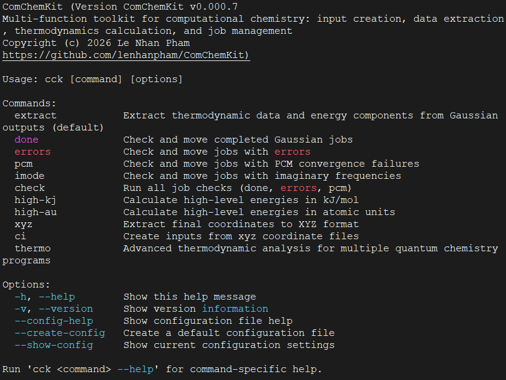

.. ComChemKit documentation master file, created by
    sphinx-quickstart on Thu Sep 05 12:00:00 2025.
    You can adapt this file completely to your liking, but it should at least
    contain the root `toctree` directive.

ComChemKit User Manual
======================

**ComChemKit** is a high-performance, cluster-safe program designed to extract data from computational chemistry outputs and to create inputs. It runs in parallel with comprehensive safety features to prevent system overload and ensure stable operation in shared computing environments.

Overview
--------

ComChemKit provides a comprehensive suite of tools for computational chemistry workflows:

* **Parallel Processing**: Efficiently processes multiple Gaussian output files simultaneously
* **Job Management**: Check and organize completed, failed, and problematic calculations
* **Energy Calculations**: Extract thermodynamic data and calculate high-level energies
* **Coordinate Processing**: Extract and organize molecular coordinates
* **Input Generation**: Create Gaussian input files from XYZ coordinate files
* **Input prarameters template**: Generate and reuse parameter templates for different calculation types
* **Windows interactive mode**: Windows users can use all features plus popular linux commands in the interactive mode 

Key Features
------------

 **Scientific Capabilities**
   - Extract thermodynamic properties (Gibbs free energy, enthalpy, entropy)
   - Check and organize job statuses (completed, failed, errors)
   - Calculate high-level energies combining different theory levels
   - Process coordinates and generate input files

 **Performance & Safety**
   - Multi-threaded processing with automatic resource detection
   - Cluster-aware operation (SLURM, PBS, SGE, LSF)
   - Memory management with automatic limits
   - Graceful shutdown handling

 **Workflow Integration**
   - Command-line interface with extensive options
   - Configuration file support for defaults
   - Template system for reproducible calculations
   - Interactive mode for Windows users

Getting Started
---------------

New to ComChemKit? Start here:

1. :doc:`installation` - Install the software on your system
2. :doc:`usage` - Learn how to use all features with examples
3. :doc:`api` - Technical API documentation

Quick Start
-----------

.. code-block:: bash

   # Basic usage - extract data from all .log files
   cck

   # Check job status and organize files
   cck done     # Move completed jobs
   cck errors   # Move failed jobs

   # Generate input files from XYZ coordinates
   cck ci --calc-type opt_freq

Contents
--------

.. toctree::
   :maxdepth: 2
   :caption: User Guide:

   installation
   usage
   api

.. toctree::
   :maxdepth: 2
   :caption: Developer Guide:

   developer

Indices and Tables
==================

* :ref:`genindex`
* :ref:`modindex`
* :ref:`search`

Support & Contributing
======================

For bug reports, feature requests, or safety concerns:

- - **Issues**: `GitHub Issues <https://github.com/lenhanpham/ComChemKit/issues>`_
- **Documentation**: This user manual
- **Help**: Use ``cck --help`` for command-line help

License
=======

ComChemKit is released under the MIT License. See the LICENSE file for details.

Version Information
===================

Current Version: **v0.000.1**

- **v0.000.1**: Initial release featuring parallel data extraction, computational chemistry input generation, and thermo module for multi-program thermodynamic calculations

.. note::
    This documentation is for ComChemKit v0.000.1. For older versions, please refer to the archived documentation.